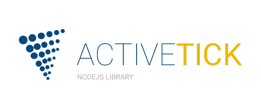

[](https://www.npmjs.com/package/active-tick) [](https://www.npmjs.com/package/active-tick)  [](https://www.npmjs.com/package/active-tick) 

[](https://drone.stackdot.com/stackdot/active-tick) [](https://david-dm.org/stackdot/active-tick)


<p align="center"></p>


ActiveTick
===

ActiveTick Nodejs Library.
- Uses promises
- Uses ES6

Requirements:
---

- [NodeJS](https://nodejs.org/en/download/) ( Version 6+ )
 - We recommend using [Node Version Manager](https://github.com/creationix/nvm)

To Get Started:
---

- Install the package in your project

```bash
npm install active-tick --save
```

To use:
```javascript

const ActiveTick = require('active-tick')({
	// Location of your ActiveTick API:
	API: 'http://localhost:5000'
})

ActiveTick.tickData( 'TSLA', '8/25/2016' )
	.then(( res ) => {
		console.log('Results:', res)
	})
	.catch(( err ) => {
		console.log('Error:', err)
	})

```


Enabling the Debugger
---

To enable [debug](https://github.com/visionmedia/debug) logs, enable them via environment variables.

To see all debug logs from this app, set the env variable:

```bash
DEBUG=active-tick*
```

Running with your project:

```bash
DEBUG=active-tick* node myproject.js
```


License
----

[MIT License](http://en.wikipedia.org/wiki/MIT_License)
